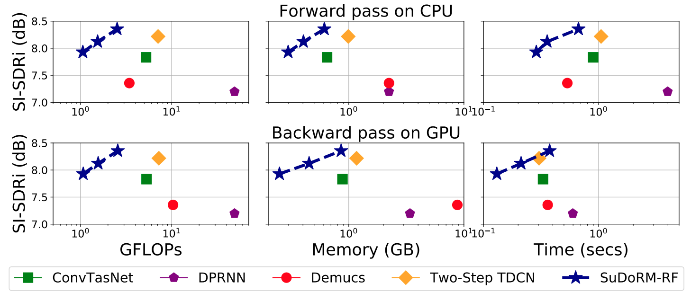
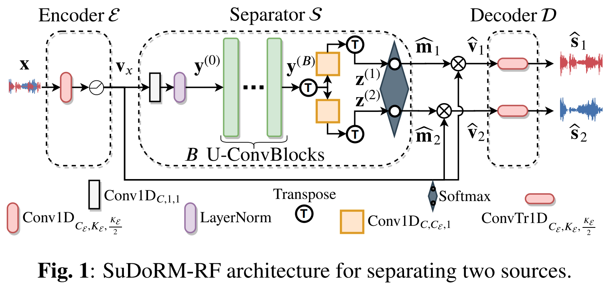
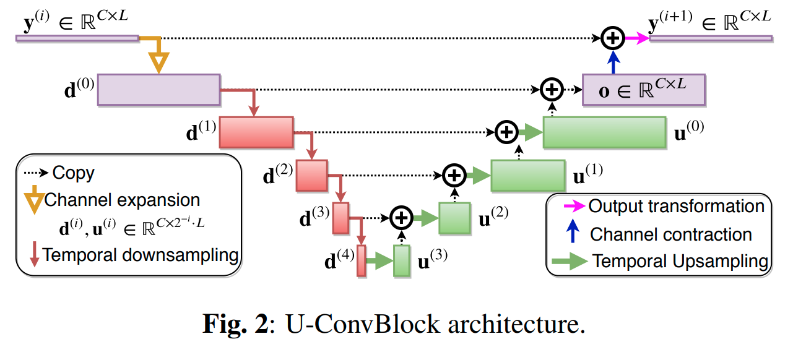

# Sudo rm -rf: Efficient Networks for Universal Sound Source Separation

TLDR; The main contribution of this paper is to jointly consider audio separation performance in multiple tasks, in addition to computational complexity and memory requirements.  We develop a family of models that take into account the following elements:

1. The number of floating points operations per fixed unit of input time.
2. Memory requirements that also include intermediate variables on the GPU.
3. Execution time for completing a forward and/or a backward pass.
4. The number of parameters for the deployed model.

Moreover, we also propose a convolutional architecture which is capable of capturing long-term temporal audio structure by using successive downsampling and resampling operations which can be efficiently implemented. Our experiments on both speech and environmental sound separation datasets show that SuDoRM-RF performs comparably and even surpasses various state-of-the-art approaches with significantly higher computational resource requirements

You can find our paper here: https://arxiv.org/abs/2007.06833. Please wait for new updates on the presentation at MLSP 2020 https://ieeemlsp.cc/!


## Table of contents

- [Model complexity and results](#model-complexity-and-results)
- [Sudo rm -rf architecture](#sudo-rm--rf-architecture)
- [How to run](#how-to-run)
- [Copyright and license](#copyright-and-license)


## Model complexity and results

As we discuss in the paper, our main objective is to find efficient architectures not only in terms of one metric but in terms of all metrics which might become a bottleneck during training or inference. This will facilitate the needs of users that do not have in their disposal (or use case) the considerable requirements that many modern models exhibit. This will enable people with no GPU access, or users with interest in edge applications to also make use of this model and not be locked out of good performance.

We present here the results from our paper:


SI-SDRi non-speech sound separation performance on ESC50 vs computational resources with an input audio of 8000 samples for all models. (Top row) computational requirements for a single forward pass on CPU (Bottom) for a backward pass on GPU. All x-axis are shown in log-scale while the 3 connected blue stars correspond to the three SuDoRM-RF configurations that we proposed. Namely, SuDoRM-RF 1.0x , SuDoRM-RF 0.5x , SuDoRM-RF 0.25x consist of 16, 8 and 4  U-ConvBlocks, respectively.


SI-SDRi separation performance for all models on both separation tasks (speech and non-speech) alongside their computational requirements for performing inference on CPU (I) and a backward update step on GPU (B) for one second of input audio or equivalently 8000 samples. * We assign the maximum SI-SDRi performance obtained by our runs and the reported number on the corresponding paper.


## Sudo rm -rf architecture

This is the intiallly proposed architecture which is a mask-based convolutional architecture for audio source separation.



Specifically, the backbone structure of this convolutional network is the SUccessive DOwnsampling and Resampling of Multi-Resolution Features (SuDoRMRF) as well as their aggregation which is performed through simple one-dimensional convolutions. We call these blocks: U-ConvBlocks because of their structure:



By repeating those blocks we are able to increase the receptive field of our network without needing dilated convolutions or recurrent connections which is more costly in terms of computational time and memory requirements.

## How to run

1. Setup your cometml credentials and paths for datasets in the config file.
```shell
vim __config__.py
```

2. Generate and preprocess the data:

```shell
cd sudo_rm_rf/utils
# Creates data for WHAM as well as WSJ0-2mix and ESC-50 preprocessed with different speakers or classes of sounds stored in separate folders.
bash generate_data.sh
```

3. Instead of creating complex scripts of mixing audio sources we introduce this very simple way of augmenting your mixtures datasets by keeping the same distribution of SNRs:  

```python
for data in tqdm(generators['train'], desc='Training'):
  opt.zero_grad()
  clean_wavs = data[-1].cuda()
  m1wavs = data[0].cuda()

  # Online mixing over samples of the batch. (This might cause to get
  # utterances from the same speaker but it's highly improbable).
  # Keep the exact same SNR distribution with the initial mixtures.

  energies = torch.sum(clean_wavs ** 2, dim=-1, keepdim=True)
  random_wavs = clean_wavs[:, torch.randperm(energies.shape[1])]
  new_s1 = random_wavs[torch.randperm(energies.shape[0]), 0, :]
  new_s2 = random_wavs[torch.randperm(energies.shape[0]), 1, :]
  new_s2 = new_s2 * torch.sqrt(energies[:, 1] /
                               (new_s2 ** 2).sum(-1, keepdims=True))
  new_s1 = new_s1 * torch.sqrt(energies[:, 0] /
                               (new_s1 ** 2).sum(-1, keepdims=True))
  m1wavs = normalize_tensor_wav(new_s1 + new_s2)
  clean_wavs[:, 0, :] = normalize_tensor_wav(new_s1)
  clean_wavs[:, 1, :] = normalize_tensor_wav(new_s2)

  rec_sources_wavs = model(m1wavs.unsqueeze(1))
  l = back_loss_tr_loss(rec_sources_wavs, clean_wavs)
  l.backward()
  opt.step()
```

4. Run the improved version of Sudo rm -rf models by replacing the final softmax with a ReLu activation, forcing the decoder to contain only one module and also replacing the Layernorm with the Global Layernorm. You can run this for WHAM clean separation experiment. 

```shell
cd sudo_rm_rf/dnn/experiments
python run_improved_sudormrf.py --train WHAM --val WHAM --test WHAM --train_val WHAM --separation_task sep_clean --n_train 20000 --n_test 3000 --n_val 3000 --n_train_val 3000 --out_channels 256 --num_blocks 16 -cad 0 1 -bs 4 --divide_lr_by 3. --upsampling_depth 5 --patience 49 -fs 8000 -tags sudo_rm_rf_16 --project_name sudormrf_wham --zero_pad --clip_grad_norm 5.0 --model_type relu
```
Or the following command for LIBRI2MIX clean speech separation experiment.
```shell
cd sudo_rm_rf/dnn/experiments
python run_improved_sudormrf.py --train LIBRI2MIX --val LIBRI2MIX --test LIBRI2MIX --train_val LIBRI2MIX --separation_task sep_clean --n_train 50800 --n_test 3000 --n_val 3000 --n_train_val 3000 --out_channels 512 --num_blocks 34 -cad 0 1 -bs 4 --divide_lr_by 3. --upsampling_depth 5 --patience 39 -fs 8000 -tags sudo_rm_rf_34 --project_name sudormrf_libri2mix --zero_pad --clip_grad_norm 5.0 --model_type relu
```

5. If you also want to take a look on some speech or environmental sound classification experiments by using our cool augmentation dataloader which is able to mix multiple datasets with specified prior probabilities:

```shell
cd sudo_rm_rf/dnn/experiments

# Speech separation experiments.

python run_sudormrf.py --n_epochs 50000 -lr 0.001 -X 5 -N 512 -B 256 -H 512 -L 21 -R 16 -bs 4 -tags environmental_sound_separation -cad 0 --train AUGMENTED_WSJMIX --val AUGMENTED_WSJMIX --train_val AUGMENTED_WSJMIX --datasets_priors 1. --max_abs_snr 5.  --n_val 3000 --n_train 20000 --project_name wsj-all --n_jobs 4 --divide_lr_by 3. --reduce_lr_every 49 --clip_grad_norm 5. --optimizer adam --selected_timelength 4. --log_audio -mlp /tmp/wsj_sudormrf -elp /tmp/wsj_sudormrf
```
```shell
# Environmental sound separation experiments.

python run_sudormrf.py --n_epochs 50000 -lr 0.001 -X 5 -N 512 -B 256 -H 512 -L 21 -R 16 -bs 4 -tags environmental_sound_separation -cad 0 --train AUGMENTED_ESC50 --val AUGMENTED_ESC50 --train_val AUGMENTED_ESC50 --datasets_priors 1. --max_abs_snr 5.  --n_val 3000 --n_train 20000 --project_name wsj-all --n_jobs 4 --divide_lr_by 3. --reduce_lr_every 49 --clip_grad_norm 5. --optimizer adam --selected_timelength 4. --log_audio -mlp /tmp/esc50_sudormrf -elp /tmp/esc50_sudormrf
```


## Copyright and license
University of Illinois Open Source License

Copyright © 2020, University of Illinois at Urbana Champaign. All rights reserved.

Developed by: Efthymios Tzinis 1, Zhepei Wang 1 and Paris Smaragdis 1,2

1: University of Illinois at Urbana-Champaign 

2: Adobe Research 

This work was supported by NSF grant 1453104. 

Paper link: https://arxiv.org/abs/2007.06833

Permission is hereby granted, free of charge, to any person obtaining a copy of this software and associated documentation files (the “Software”), to deal with the Software without restriction, including without limitation the rights to use, copy, modify, merge, publish, distribute, sublicense, and/or sell copies of the Software, and to permit persons to whom the Software is furnished to do so, subject to the following conditions: Redistributions of source code must retain the above copyright notice, this list of conditions and the following disclaimers. Redistributions in binary form must reproduce the above copyright notice, this list of conditions and the following disclaimers in the documentation and/or other materials provided with the distribution. Neither the names of Computational Audio Group, University of Illinois at Urbana-Champaign, nor the names of its contributors may be used to endorse or promote products derived from this Software without specific prior written permission. THE SOFTWARE IS PROVIDED “AS IS”, WITHOUT WARRANTY OF ANY KIND, EXPRESS OR IMPLIED, INCLUDING BUT NOT LIMITED TO THE WARRANTIES OF MERCHANTABILITY, FITNESS FOR A PARTICULAR PURPOSE AND NONINFRINGEMENT. IN NO EVENT SHALL THE CONTRIBUTORS OR COPYRIGHT HOLDERS BE LIABLE FOR ANY CLAIM, DAMAGES OR OTHER LIABILITY, WHETHER IN AN ACTION OF CONTRACT, TORT OR OTHERWISE, ARISING FROM, OUT OF OR IN CONNECTION WITH THE SOFTWARE OR THE USE OR OTHER DEALINGS WITH THE SOFTWARE.
